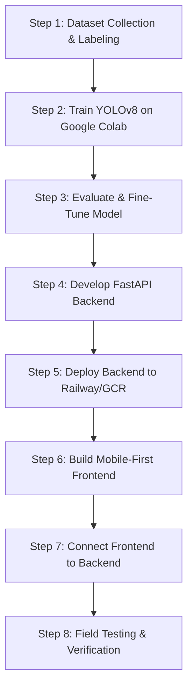

# CropGrade AI: Round 1 Implementation Plan

CropGrade AI is an AI-powered tomato quality grading and shelf-life estimation application. This document details the specifications, architecture, and step-by-step development order for **Round 1 (MVP)**.

---

## 📱 What Round 1 Actually Means (The User Flow)
1. **Capture**: The user opens the web application on a mobile browser.
2. **Scan**: Taps the camera interface, points it at a box of tomatoes containing a standard reference object (e.g., a ₹10 coin or an A4 sheet of paper), and takes a photo.
3. **Analyze**: The backend processes the image using a YOLOv8 object detection model.
4. **Display**: The application displays the grading results:
   - **Total Count**: How many tomatoes were detected in the box.
   - **Size Category**: Individual classification of each tomato as *Small*, *Medium*, or *Large* (estimated via ratio to the reference object).
   - **Color Stage**: Ripeness stage classification (*Green*, *Pink*, *Red*, *Overripe*).
   - **Defects Detected**: Identification of surface defects (*cracks*, *rot*, *bruises*).
   - **Quality Grade**: A calculated quality classification (*Grade A*, *Grade B*, *Grade C*) based on color, size, and defects.
   - **Estimated Shelf Life**: Days remaining before decay, derived from ripeness and defect rules.
   - **Overall Batch Summary**: Aggregated analysis of the scanned box.

---

## 🛠️ The 4 Core Architectural Parts

### Part 1 — Dataset Acquisition & Labeling
A high-accuracy model requires a high-quality, representative dataset.
* **Sources**:
  * Public repositories: Kaggle (search for "tomato disease dataset" and "tomato grading dataset"), PlantVillage dataset, and Roboflow public datasets.
  * Custom dataset (Critical for India): Capture **500–1000 photos** of tomatoes at a local mandi (market) in various lighting, packaging, and ripeness states.
* **Annotation**: Use **Roboflow** or **LabelImg** to draw bounding boxes around each tomato and label them with:
  * Ripeness color stage
  * Defect types (cracks, rot, bruises)
  * Grade (A, B, C)

### Part 2 — ML Model (YOLOv8)
* **Model Choice**: **YOLOv8** (Ultralytics) for simultaneous object detection and multi-class classification.
* **Size Estimation Trick**: Place a standard-size reference object (like a ₹10 coin or A4 paper) in the box. Use the bounding box pixel ratio between the reference object and each tomato to calculate the relative physical size.
* **Shelf Life Estimation**: Apply a rule-based algorithm on top of the model outputs:
  * `Red` + `No Defects` = **5–7 days** shelf life
  * `Pink` + `Minor Defects` = **3–5 days** shelf life
  * `Overripe` or `Rot` = **1–2 days** shelf life

### Part 3 — Backend API (FastAPI)
* **Framework**: **FastAPI** (Python) for high performance and rapid development.
* **Processing Flow**:
  1. Frontend sends an HTTP POST request containing the image.
  2. Backend loads the YOLOv8 model, runs inference on the image, and calculates physical sizes using the reference object ratio.
  3. Backend applies shelf-life heuristic rules.
  4. Backend returns a structured JSON payload to the client.
* **Hosting**: Deploy on **Railway.app** or **Google Cloud Run** (utilizing free tiers).

### Part 4 — Frontend Client (Mobile Web)
* **Approach**: To save 2–3 weeks of mobile app overhead in Round 1, build a responsive **Web App** optimized for mobile browsers instead of a native Flutter application.
* **Tech Stack**: React or vanilla HTML5 + JavaScript.
* **Key Feature**: Standard HTML5 camera API (`<input type="file" accept="image/*" capture="camera">`) to trigger the device's native camera.

---

## 📅 Step-by-Step Development Order

1. **Step 1 — Collect and Label Dataset (2–3 Weeks)**: Focus heavily on gathering 500-1000 real-world tomato images. Check Roboflow for pre-existing datasets to accelerate this phase.
2. **Step 2 — Model Training (1 Week)**: Train YOLOv8 on Google Colab using a free GPU instance.
3. **Step 3 — Testing & Improvement (1 Week)**: Validate model accuracy on novel test images, adjusting training hyperparameters as needed.
4. **Step 4 — Build Backend API (1 Week)**: Write the FastAPI endpoints, integrate YOLOv8 inference, and build size/shelf-life logic.
5. **Step 5 — Deployment (2–3 Days)**: Host the backend on Railway.app or Google Cloud Run.
6. **Step 6 — Build Frontend (1 Week)**: Implement the user interface with mobile camera access.
7. **Step 7 — Integration (3–5 Days)**: Connect the frontend to the backend API and handle response displaying.
8. **Step 8 — Field Testing (Ongoing)**: Test the live app on real tomato boxes at markets and gather feedback.

---

## ⏳ Project Timeline & Cost Estimates
* **Total Time**: 6 to 8 weeks (assuming 4–5 hours per day).
* **Development Cost**: Mostly free using free tiers (Google Colab, Railway, Github, Roboflow).
* **Aesthetic Goal**: The frontend UI should be vibrant, clean, and intuitive for farmers/vendors, emphasizing visual cues (green, yellow, red cards) for quality levels.
